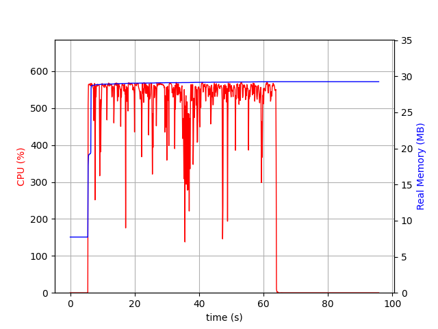

# go-node-server-benchmark-test

## Overview

This project is a simple benchmark test designed to compare the speed and memory consumption of Go and Node.js server endpoints. At work, we had a similar implementation using Node.js, and I was curious to see the performance gains when switching to Go.

The API takes in an array in JSON format, filters the items, and returns the filtered results. The primary goal was to minimize the application's memory footprint, enabling efficient filtering of large JSON data. To achieve this, I implemented a streaming approach, processing each item one by one.

For the fun of it, I included a `/status` endpoint to monitor the server's health. This was due to past issues we had with health check failures under heavy load (e.g., Kubernetes restarting our production service unexpectedly).

To ensure fairness in comparing Node.js, which cannot natively run code in parallel, I used the "cluster" module to run the API on all available cores.

The load test was conducted with 100 parallel requests and 50 iterations on a MacBook Pro 2019 with an Intel i7 6-Core 2.6GHz CPU. A heartbeat request was sent every 5 seconds.

## Results

### With 12 threads (utilizing all logical processors):

#### Go:

- **Filter request:** Mean: 1.86734146s - Median: 1.81635645s - Max: 3.443674941s - Min: 386.940174ms
- **Heartbeat request:** Mean: 80.81609ms - Median: 10.963387ms - Max: 352.184537ms - Min: 1.473372ms

#### Node:

- **Filter request:** Mean: 8.340175742s - Median: 8.027013732s - Max: 18.5924755s - Min: 1.033271597s
- **Heartbeat request:** Mean: 3.110083141s - Median: 1.376866903s - Max: 16.185833569s - Min: 4.93769ms

### With 6 threads:

#### Go:

- **Filter request:** Mean: 2.305342424s - Median: 2.074621453s - Max: 4.373371328s - Min: 464.529213ms
- **Heartbeat request:** Final: Mean: 40.562995ms - Median: 12.623554ms - Max: 217.326776ms - Min: 2.778162ms

#### Node:

- **Filter request:** Mean: 9.591364943s - Median: 8.920234559s - Max: 22.272940865s - Min: 600.678025ms
- **Heartbeat request:** Mean: 1.193961734s - Median: 951.717178ms - Max: 15.531011697s - Min: 1.879371ms

### With 2 threads:

#### Go:

- **Filter request:** Mean: 5.918676677s - Median: 5.118359501s - Max: 14.060162721s - Min: 507.217983ms
- **Heartbeat request:** Mean: 597.767714ms - Median: 382.351985ms - Max: 2.252416645s - Min: 11.297192ms

#### Node:

- **Filter request:** Mean: 14.275448932s - Median: 14.01474173s - Max: 35.051199588s - Min: 464.827696ms
- **Heartbeat request:** Mean: 2.422905599s - Median: 544.479484ms - Max: 34.360253065s - Min: 46.04413ms

### With 1 thread:

#### Go:

- **Filter request:** Mean: 7.195549109s - Median: 7.168784291s - Max: 10.174155799s - Min: 3.203796607s
- **Heartbeat request:** Mean: 1.301962979s - Median: 1.331908661s - Max: 2.54616354s - Min: 64.782577ms

#### Node:

- **Filter request:** Mean: 24.810422954s - Median: 24.293775647s - Max: 58.959508217s - Min: 426.471914ms
- **Heartbeat request:** Mean: 727.472119ms - Median: 480.342164ms - Max: 43.445116506s - Min: 511.955µs

## Conclustion

As expected, the difference in performance between 12 and 6 threads is minimal for both Go and Node.js, given that the test was run on a machine with 6 physical cores, and the workload involved more processing than I/O operations.

Go consistently outperforms Node.js in these benchmarks, particularly in CPU-bound tasks. Remarkably, Go demonstrates strong performance even when running on a single core, even surpassing Node.js running on all cores.
